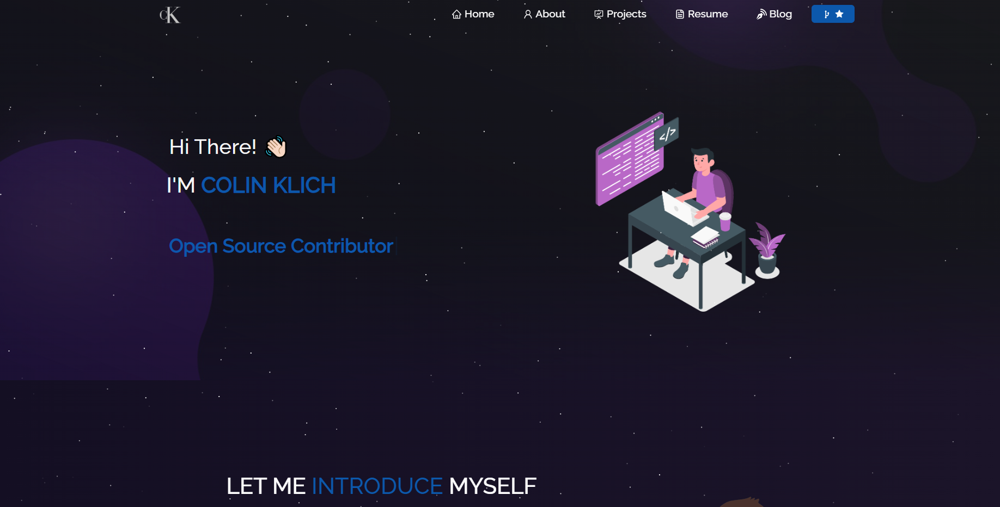

<h2 align="center">
  Portfolio Website - v1.5 
  <a href="[https://portfolio-website-colinklich.vercel.app/](https://www.colinklich.com/)" target="_blank">colinklich.tech</a>
</h2>

  

 

<h3 align="center">
    🔹
    <a href="https://github.com/soumyajit4419/Portfolio/issues">Report Bug</a> &nbsp; &nbsp;
    🔹
    <a href="https://github.com/soumyajit4419/Portfolio/issues">Request Feature</a>
</h3>

## TL;DR

Based on a portfolio by [Soumyajit4419](https://github.com/soumyajit4419/Portfolio). 

## Built With

My personal portfolio <a href="[https://portfolio-website-colinklich.vercel.app/](https://www.colinklich.com/)" target="_blank">colinklich.com</a> which features some of my github projects as well as my resume and technical skills. 

This project was built using these technologies.

- React.js
- Node.js
- Express.js
- CSS3
- VsCode
- Vercel

## Features

**📖 Multi-Page Layout**

**🎨 Styled with React-Bootstrap and Css with easy to customize colors**

**📱 Fully Responsive**

### Show your support

Give a ⭐ if you like this website!

